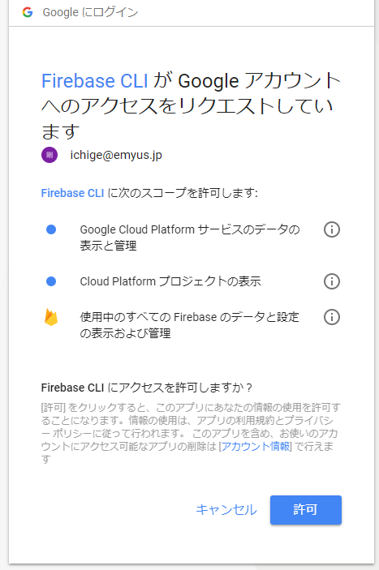
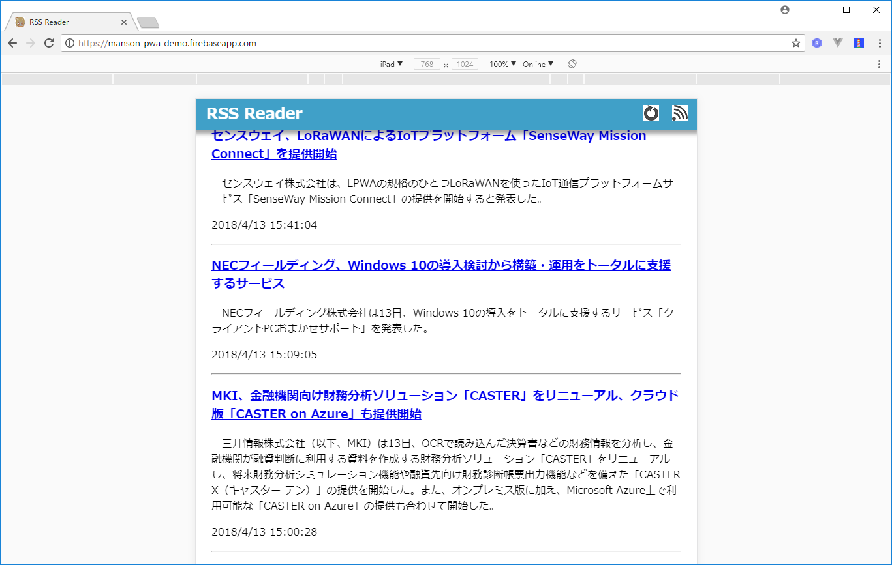

# 使ってみた

[pwa-sample](https://github.com/ichige/pwa-sample) を Firebase でホスティングしてみた。

## ログイン

```bash
# ログインコマンド実行
> firebase login
# Firebaseが匿名のCLI使用法とエラー報告情報を収集できるようにしますか？ → y
? Allow Firebase to collect anonymous CLI usage and error reporting information? (Y/n)
# ブラウザが開くので、googleアカウントでログインする。
```

Firebase CLI が Google アカウントへのアクセスをリクエストしています。

→ 「許可」する。

```basg
+  Success! Logged in as ichige@emyus.jp
```

Windows セキュリティの警告が出るが、「アクセスを許可」する。

## プロジェクトを開始する

準備出来ましたか？ → y

```bash
> firebase init


     ######## #### ########  ######## ########     ###     ######  ########
     ##        ##  ##     ## ##       ##     ##  ##   ##  ##       ##
     ######    ##  ########  ######   ########  #########  ######  ######
     ##        ##  ##    ##  ##       ##     ## ##     ##       ## ##
     ##       #### ##     ## ######## ########  ##     ##  ######  ########

You're about to initialize a Firebase project in this directory:

  C:\Users\tichige.SHINWART\Documents\vscoce-pj\pwa-sample

? Are you ready to proceed? (Y/n)
```

ホスティングをチェック(spaceキー)する。

```bash
? Which Firebase CLI features do you want to setup for this folder? Press Space to select features, then Enter to confirm your choices. (Press <space> to select)
 ( ) Database: Deploy Firebase Realtime Database Rules
 ( ) Firestore: Deploy rules and create indexes for Firestore
 ( ) Functions: Configure and deploy Cloud Functions
>(*) Hosting: Configure and deploy Firebase Hosting sites
 ( ) Storage: Deploy Cloud Storage security rules
```

あらかじめ作っておいたプロジェクトを選択する。

```bash
=== Project Setup

First, let's associate this project directory with a Firebase project.
You can create multiple project aliases by running firebase use --add,
but for now we'll just set up a default project.

? Select a default Firebase project for this directory: (Use arrow keys)
  [don't setup a default project]
> manson-pwa-demo (manson-pwa-demo)
  [create a new project]
```

公開ディレクトリを入力する。デフォルトはpublicだが、ここでは rss だ。

```bash
=== Hosting Setup

Your public directory is the folder (relative to your project directory) that
will contain Hosting assets to be uploaded with firebase deploy. If you
have a build process for your assets, use your build's output directory.

? What do you want to use as your public directory? (public)
```

単一ページアプリケーションとして設定する（すべてのURLを/index.htmlに書き換えます）→ y

```bash
? Configure as a single-page app (rewrite all urls to /index.html)? (y/N)
```

？ ファイルrss / index.htmlは既に存在します。 上書きすますか？ → N

```bash
? File rss/index.html already exists. Overwrite? (y/N)
i  Skipping write of rss/index.html

i  Writing configuration info to firebase.json...
i  Writing project information to .firebaserc...

+  Firebase initialization complete!
```

## デプロイする

準備が出来たらコマンドを実行するだけ。

```bash
> firebase deploy

=== Deploying to 'manson-pwa-demo'...

i  deploying hosting
i  hosting: preparing rss directory for upload...
+  hosting: 14 files uploaded successfully

+  Deploy complete!

Project Console: https://console.firebase.google.com/project/manson-pwa-demo/overview
Hosting URL: https://manson-pwa-demo.firebaseapp.com
```

[https://manson-pwa-demo.firebaseapp.com](https://manson-pwa-demo.firebaseapp.com) にアクセスして確認する。




## ログアウト

```bash
> firebase logout
+  Logged out from ichige@emyus.jp
```